# IMPLEMENTASI DATABASE TAGIHAN LISTRIK KE MYSQL

## 1. Hasil Normalisasi dari Draw.io

Berdasarkan hasil normalisasi database pada Draw.io, database **Tagihan Listrik** sudah dinormalisasi sampai bentuk **3NF (Third Normal Form)**.

Hasil akhirnya terdiri dari 6 tabel:

1. `tipe_kamar`
2. `penghuni`
3. `kamar`
4. `meteran`
5. `tarif_listrik`
6. `tagihan`

Hubungan antar tabel digunakan untuk menghindari data yang berulang dan membuat data lebih terstruktur.

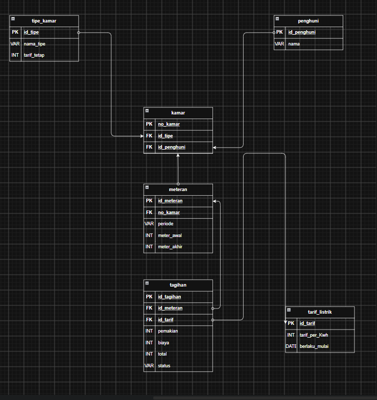


---

# 2. Menyalakan XAMPP

Sebelum membuat database, buka **XAMPP Control Panel**.

Kemudian nyalakan:

* Apache
* MySQL

Untuk database MySQL, yang paling penting adalah **MySQL harus berstatus Running**.

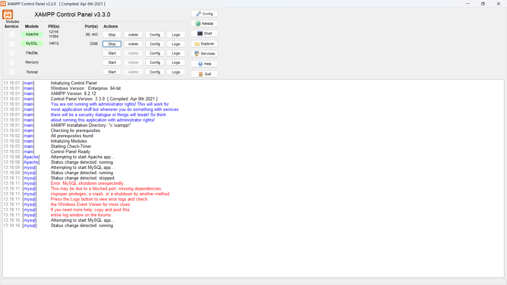


---

# 3. Membuka Command Prompt

Setelah MySQL aktif, buka **Command Prompt (CMD)**.

Kemudian masuk ke folder MySQL dengan perintah:

```cmd
cd C:\xampp\mysql\bin
```

Perintah tersebut digunakan supaya CMD berada di lokasi program MySQL sehingga kita dapat menjalankan perintah `mysql`.


---

# 4. Login ke MySQL

Ketik:

```cmd
mysql -u root -p
```

Kemudian tekan **Enter**.

Jika MySQL root tidak menggunakan password, langsung tekan **Enter** ketika diminta password.

Jika berhasil, akan muncul tampilan seperti:

```text
Welcome to the MySQL monitor.
```

Artinya kita sudah berhasil masuk ke MySQL.

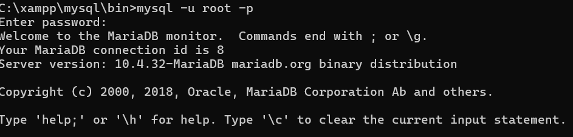


---

# 5. Membuat Database

Setelah berhasil masuk MySQL, buat database dengan perintah:

```sql
CREATE DATABASE db_tagihan_listrik;
```

Kemudian pilih database tersebut:

```sql
USE db_tagihan_listrik;
```

Untuk memastikan database yang digunakan sudah benar:

```sql
SELECT DATABASE();
```

Hasilnya harus menunjukkan:

```text
db_tagihan_listrik
```

Database ini nantinya digunakan untuk menyimpan seluruh tabel hasil normalisasi dari Draw.io.

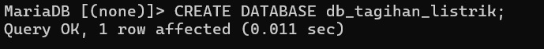


---

# 6. Membuat Tabel `tipe_kamar`

Tabel pertama adalah `tipe_kamar`.

Tabel ini digunakan untuk menyimpan jenis kamar dan tarif tetap dari setiap jenis kamar.

```sql
CREATE TABLE tipe_kamar (
    id_tipe INT AUTO_INCREMENT PRIMARY KEY,
    nama_tipe VARCHAR(50) NOT NULL,
    tarif_tetap DECIMAL(12,2) NOT NULL
);
```

Keterangan:

* `id_tipe` → ID unik untuk setiap tipe kamar.
* `nama_tipe` → nama atau jenis kamar.
* `tarif_tetap` → biaya tetap berdasarkan tipe kamar.
* `PRIMARY KEY` → menjadi identitas utama tabel.

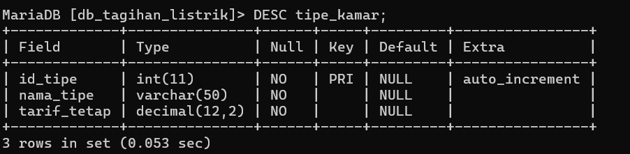


---

# 7. Membuat Tabel `penghuni`

Tabel `penghuni` digunakan untuk menyimpan data orang yang menempati kamar.

```sql
CREATE TABLE penghuni (
    id_penghuni INT AUTO_INCREMENT PRIMARY KEY,
    nama VARCHAR(100) NOT NULL
);
```

Keterangan:

* `id_penghuni` → ID unik penghuni.
* `nama` → nama penghuni.

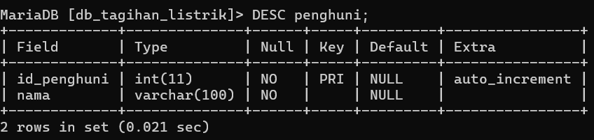


---

# 8. Membuat Tabel `kamar`

Tabel `kamar` digunakan untuk menghubungkan kamar dengan tipe kamar dan penghuni.

```sql
CREATE TABLE kamar (
    no_kamar INT PRIMARY KEY,
    id_tipe INT NOT NULL,
    id_penghuni INT NOT NULL,

    CONSTRAINT fk_kamar_tipe
        FOREIGN KEY (id_tipe)
        REFERENCES tipe_kamar(id_tipe),

    CONSTRAINT fk_kamar_penghuni
        FOREIGN KEY (id_penghuni)
        REFERENCES penghuni(id_penghuni)
);
```

Pada tabel ini terdapat dua **foreign key**, yaitu:

* `id_tipe` → menghubungkan kamar dengan `tipe_kamar`.
* `id_penghuni` → menghubungkan kamar dengan `penghuni`.

Dengan adanya foreign key, data antar tabel dapat saling berhubungan.

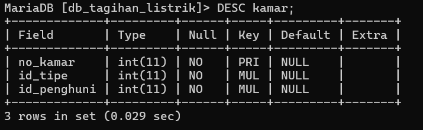


---

# 9. Membuat Tabel `meteran`

Tabel `meteran` digunakan untuk menyimpan data penggunaan listrik berdasarkan pembacaan meteran.

```sql
CREATE TABLE meteran (
    id_meteran INT AUTO_INCREMENT PRIMARY KEY,
    no_kamar INT NOT NULL,
    periode VARCHAR(20) NOT NULL,
    meter_awal INT NOT NULL,
    meter_akhir INT NOT NULL,

    CONSTRAINT fk_meteran_kamar
        FOREIGN KEY (no_kamar)
        REFERENCES kamar(no_kamar)
);
```

Keterangan:

* `id_meteran` → ID data meteran.
* `no_kamar` → kamar yang menggunakan meteran.
* `periode` → periode pencatatan listrik.
* `meter_awal` → angka meteran pada awal periode.
* `meter_akhir` → angka meteran pada akhir periode.

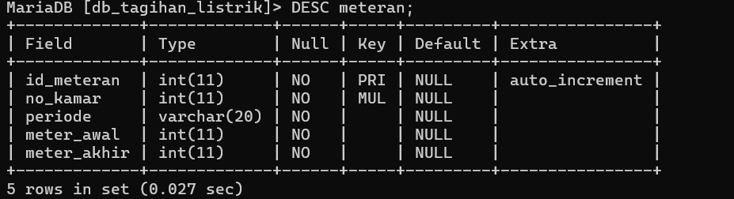


---

# 10. Membuat Tabel `tarif_listrik`

Tabel `tarif_listrik` digunakan untuk menyimpan tarif listrik per kWh.

```sql
CREATE TABLE tarif_listrik (
    id_tarif INT AUTO_INCREMENT PRIMARY KEY,
    tarif_per_kwh DECIMAL(12,2) NOT NULL,
    berlaku_mulai DATE NOT NULL
);
```

Keterangan:

* `id_tarif` → ID tarif.
* `tarif_per_kwh` → harga listrik untuk setiap kWh.
* `berlaku_mulai` → tanggal mulai berlakunya tarif.

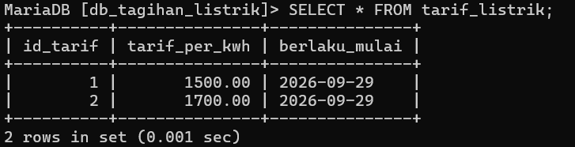


---

# 11. Membuat Tabel `tagihan`

Tabel `tagihan` digunakan untuk menyimpan hasil perhitungan tagihan listrik.

```sql
CREATE TABLE tagihan (
    id_tagihan INT AUTO_INCREMENT PRIMARY KEY,
    id_meteran INT NOT NULL,
    id_tarif INT NOT NULL,
    pakai INT NOT NULL,
    biaya DECIMAL(12,2) NOT NULL,
    total DECIMAL(12,2) NOT NULL,
    status VARCHAR(20) NOT NULL,

    CONSTRAINT fk_tagihan_meteran
        FOREIGN KEY (id_meteran)
        REFERENCES meteran(id_meteran),

    CONSTRAINT fk_tagihan_tarif
        FOREIGN KEY (id_tarif)
        REFERENCES tarif_listrik(id_tarif)
);
```

Tabel ini memiliki hubungan dengan:

* `meteran` melalui `id_meteran`.
* `tarif_listrik` melalui `id_tarif`.

Sehingga data tagihan dapat mengetahui penggunaan listrik dan tarif yang digunakan.

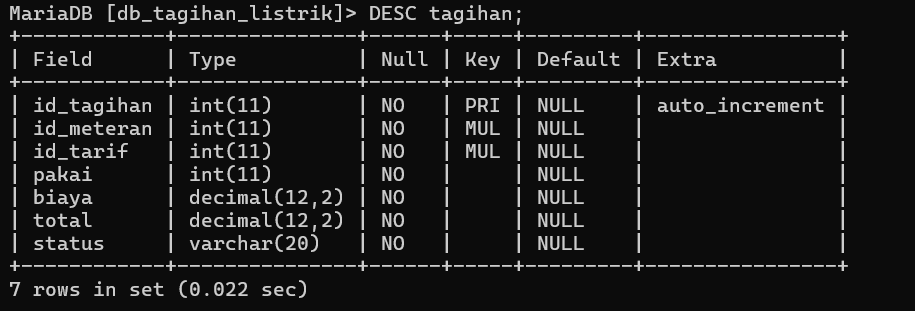


---

# 12. Mengecek Semua Tabel

Setelah seluruh tabel dibuat, jalankan:

```sql
SHOW TABLES;
```

Jika berhasil, akan terlihat 6 tabel:

```text
kamar
meteran
penghuni
tagihan
tarif_listrik
tipe_kamar
```

Perintah `SHOW TABLES` digunakan untuk memastikan semua tabel sudah berhasil dibuat di database.

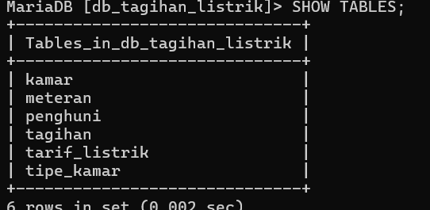


---

# 13. Memasukkan Data Contoh

Setelah struktur tabel selesai, masukkan beberapa data untuk melakukan pengujian.

### Data tipe kamar

```sql
INSERT INTO tipe_kamar (nama_tipe, tarif_tetap)
VALUES
('Standar', 50000),
('Premium', 75000);
```

### Data penghuni

```sql
INSERT INTO penghuni (nama)
VALUES
('Andi'),
('Budi'),
('Citra');
```

### Data kamar

```sql
INSERT INTO kamar (no_kamar, id_tipe, id_penghuni)
VALUES
(101, 1, 1),
(102, 1, 2),
(201, 2, 3);
```

### Data meteran

```sql
INSERT INTO meteran
(no_kamar, periode, meter_awal, meter_akhir)
VALUES
(101, 'September 2026', 1000, 1150),
(102, 'September 2026', 2000, 2140),
(201, 'September 2026', 3000, 3200);
```

### Data tarif listrik

```sql
INSERT INTO tarif_listrik
(tarif_per_kwh, berlaku_mulai)
VALUES
(1500, '2026-09-01'),
(1700, '2026-09-01');
```

---

# 14. Memasukkan Data Tagihan

Setelah data meteran dan tarif tersedia, masukkan data tagihan:

```sql
INSERT INTO tagihan
(id_meteran, id_tarif, pakai, biaya, total, status)
VALUES
(1, 1, 150, 225000, 275000, 'Belum Lunas'),
(2, 1, 140, 210000, 260000, 'Lunas'),
(3, 2, 200, 340000, 415000, 'Belum Lunas');
```

Data tersebut digunakan sebagai contoh untuk menguji apakah tabel `tagihan` dapat terhubung dengan tabel `meteran` dan `tarif_listrik`.

---

# 15. Mengecek Hubungan Antar Tabel

Untuk melihat data dari beberapa tabel sekaligus, gunakan perintah `JOIN`:

```sql
SELECT
    tagihan.id_tagihan,
    kamar.no_kamar,
    penghuni.nama AS nama_penghuni,
    tipe_kamar.nama_tipe,
    meteran.periode,
    meteran.meter_awal,
    meteran.meter_akhir,
    tagihan.pakai,
    tarif_listrik.tarif_per_kwh,
    tagihan.biaya,
    tagihan.total,
    tagihan.status
FROM tagihan
JOIN meteran
    ON tagihan.id_meteran = meteran.id_meteran
JOIN kamar
    ON meteran.no_kamar = kamar.no_kamar
JOIN penghuni
    ON kamar.id_penghuni = penghuni.id_penghuni
JOIN tipe_kamar
    ON kamar.id_tipe = tipe_kamar.id_tipe
JOIN tarif_listrik
    ON tagihan.id_tarif = tarif_listrik.id_tarif;
```

Perintah tersebut digunakan untuk membuktikan bahwa tabel-tabel yang sudah dibuat memang saling terhubung.

Hasilnya akan menampilkan informasi seperti:

* nomor kamar,
* nama penghuni,
* tipe kamar,
* periode meteran,
* penggunaan listrik,
* tarif listrik,
* biaya,
* total tagihan,
* status pembayaran.

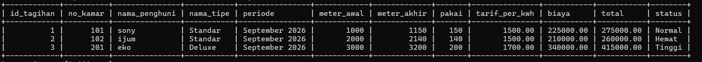


---

# 16. Kesimpulan

Database **Tagihan Listrik** berhasil dibuat berdasarkan hasil normalisasi dari Draw.io sampai bentuk **3NF**.

Database terdiri dari 6 tabel, yaitu:

```text
tipe_kamar
penghuni
kamar
meteran
tarif_listrik
tagihan
```

Setiap tabel memiliki fungsi masing-masing dan dihubungkan menggunakan **Primary Key (PK)** dan **Foreign Key (FK)**.

Setelah database dan tabel dibuat melalui Command Prompt, data contoh dimasukkan dan hubungan antar tabel diuji menggunakan perintah `JOIN`.

Dengan demikian, hasil normalisasi dari Draw.io sudah dapat diterapkan ke dalam database MySQL.
